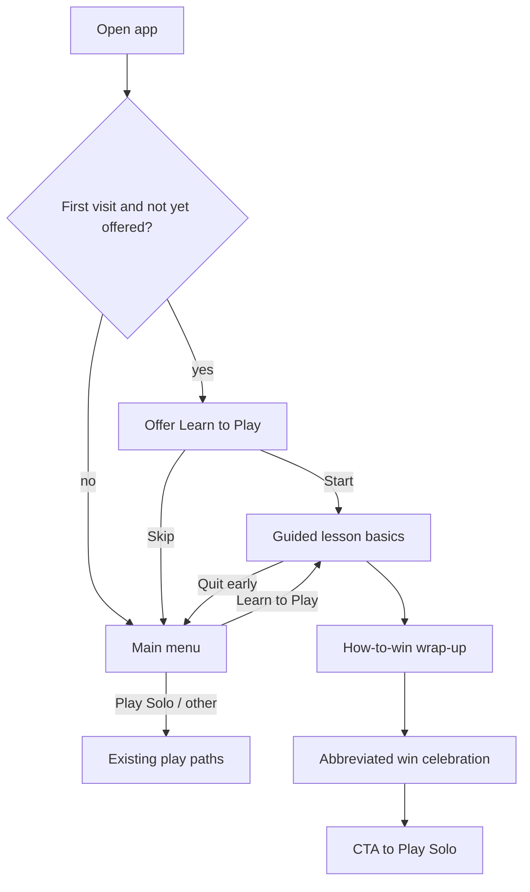

# Learn to Play - Plan

## Goal Capsule

**Objective:** Let first-time players learn Hand & Foot *and* this app by playing a short guided lesson on the real board, then finish with a short how-to-win wrap-up so they can play solo with confidence.

**Product authority:** This Product Contract.

**Open blockers:** None.

## Product Contract

### Summary

Ship an opt-in **Learn to Play** guided lesson mode: a scripted mini-game on the real board that unlocks one action at a time (rules + UI), offers itself once on first visit (skippable) and always from the main menu, then ends with a short how-to-win stretch and an abbreviated win moment before pointing people to normal Play Solo.

### Problem Frame

Hand & Foot is unfamiliar to many players, and this app’s controls are a second learning surface. The product is still early, so there is little observed usage data.
Static How to Play dialogs exist but do not walk someone through a turn.
New players need a low-friction path that teaches by doing rather than by reading.

### Key Decisions

- **Teaching shape: guided lesson game.** Scripted steps with one unlocked action and coach copy beat free-play tips or drill stations for first-timers who want to “play along.”
- **Two-part flow.** Basics by playing, then a short how-to-win wrap-up (not a deep strategy course).
- **Entry: first-visit offer + always on menu.** Offer once on first open (easy to skip); keep Learn to Play on the main menu for replay.
- **Keep static How to Play.** The existing rules dialogs stay as reference; Learn to Play does not replace them.
- **First-visit dismiss on skip or early exit.** Skipping or quitting mid-lesson dismisses the first-visit offer so we do not nag; the menu entry always remains for restart.
- **End with an abbreviated win.** After the how-to-win stretch, celebrate a light guided win, then CTA into normal Play Solo.

### Actors

- A1. First-time / returning learner — has never played Hand & Foot, or is learning this version and the app.
- A2. Skilled player revisiting — may open Learn to Play from the menu for a refresher.

### Key Flows

- F1. First-visit offer — On first open (when not yet dismissed), show an easy-to-skip Learn to Play offer; Start enters the guided lesson; Skip dismisses the offer and lands on the main menu.
- F2. Menu entry — Main menu always exposes Learn to Play; choosing it starts (or restarts) the guided lesson.
- F3. Basics lessons — Player completes scripted steps covering draw, meld/play-down, discard, hand-to-foot, and matching app controls; only the current step’s action is enabled; coach text explains the rule and the tap.
- F4. How-to-win wrap-up — Short guided stretch on books (clean/dirty), going out, and a few winning tips.
- F5. Completion — Abbreviated win celebration, then a clear CTA to Play Solo; first-visit offer remains dismissed.
- F6. Early exit — Player can leave mid-lesson back to the main menu; first-visit offer is treated as seen.

### Requirements

**Entry and presence**

- R1. On first launch, if the Learn to Play offer has not been dismissed, show a skippable offer to start the guided lesson.
- R2. The main menu always includes a Learn to Play entry, independent of first-visit state.
- R3. Skipping the first-visit offer or quitting mid-lesson dismisses future first-visit offers without removing the menu entry.

**Guided lesson behavior**

- R4. Learn to Play uses a guided lesson on the real game board: coach prompts plus highlighting, with only the current step’s action available.
- R5. Basics cover core turn loop and app use: draw, meld / play-down, discard, and picking up the foot.
- R6. After basics, a short how-to-win wrap-up teaches clean/dirty books, going out, and a few winning tips.
- R7. Completing the wrap-up ends with an abbreviated win celebration and a CTA to start normal Play Solo.
- R8. Existing static How to Play dialogs remain available as rule reference.

**Teaching content boundaries**

- R9. Content teaches this app’s UI and this product’s Hand & Foot rules (family rules already documented for the product).
- R10. How-to-win content stays short tip-level; it is not a full strategy course.

### Acceptance Examples

- AE1. When a brand-new player opens the app the first time, they see a skippable Learn to Play offer and can start without opening the static rules dialog.
- AE2. When they skip the offer, they reach the main menu with Play Solo available, and the first-visit offer does not appear again on the next launch.
- AE3. When they choose Learn to Play from the menu later, the guided lesson starts from the beginning.
- AE4. During a basics step for draw, only Draw (or the taught control) is actionable; other actions stay locked until that step completes.
- AE5. When they finish the how-to-win wrap-up, they see a brief win celebration and a clear path into Play Solo.
- AE6. When they quit mid-lesson, they return to the main menu, first-visit offer stays dismissed, and Learn to Play remains on the menu.

### Success Criteria

- A first-time player can complete Learn to Play without reading the static rules dialog.
- After completion they understand enough rules, app controls, and tip-level winning ideas to start Play Solo with confidence.
- First-visit prompting is not naggy after skip or early exit.

### Scope Boundaries

**In scope**

- Guided lesson game mode (scripted steps, coach, highlights)
- First-visit skippable offer + main-menu entry
- Basics + short how-to-win wrap-up + abbreviated win + CTA to Play Solo

**Deferred for later**

- Free-play coach overlay during normal solo
- Practice-station / drill curriculum as primary mode
- Deep strategy coaching beyond tip-level wrap-up
- Multiplayer-specific tutorial
- Adaptive difficulty or personality-specific teaching

**Outside this product’s identity for v1**

- Replacing or removing static How to Play
- Forced, unskippable onboarding
- Full multi-round tournament simulation as the lesson

### Dependencies / Assumptions

- Assumption: Early-product lack of usage data means pain is inferred (rules + controls overwhelm), not measured.
- Assumption: Solo stack is the right host for the lesson; multiplayer is out of scope for v1.
- Assumption: An abbreviated win (not a full score-to-8500 match) is enough to satisfy the “feel like I can win / know how to win” goal.
- Dependency: Existing main menu, GameScreen/solo UI patterns, and static How to Play remain in place.
- Dependency: Product Hand & Foot rules already documented for teaching content (family rules / in-app How to Play).

### Outstanding Questions

**Resolve Before Planning:** none.

**Deferred to Planning** — resolved in Planning Contract below.

### Sources / Research

- No interactive tutorial exists today; help is static How to Play on the main menu and in solo via DialogManager / GameAppBar.
- `docs/CODE_IMPROVEMENTS.md` §5.1 already calls out interactive tutorial + contextual hints as high-impact UX.
- Spec polish checklist includes unchecked Tutorial/help (`docs/hand_and_foot_complete_specification.md`).
- Solo entry today: MainMenuScreen PLAY SOLO → GameScreen (setup is optional via gear); `DeviceService.isFirstRun` exists but is unused for onboarding.

---

## Planning Contract

### Assumptions

- KTD1. Dedicated `LearnToPlayScreen` hosts the lesson (not forking full `GameScreen` saves/Perfect Grab/analytics paths).
- KTD2. Lesson uses a real `GameController` with one conservative bot, fixed seed, scripted human hand after deal; bot turns are auto-skipped during the lesson.
- KTD3. Prefs key `learn_to_play_offer_dismissed` (bool) gates first-visit offer.
- KTD4. Perfect Grab, auto-save, and analytics are disabled for Learn sessions.
- KTD5. Foot teaching includes a live “go to foot” when the last hand card is discarded after the basic meld turn (scripted short hand).
- KTD6. How-to-win steps are coach+Continue info steps; abbreviated win is a dialog then navigate to `GameScreen` for Play Solo (or pushReplacement to GameScreen with defaults).

### Key Technical Decisions

- **Dedicated screen + GameController** — Reuse models/actions; avoid Perfect Grab / persistence coupling in GameScreen.
- **Step machine** — `LearnToPlayCurriculum` lists steps; `LearnToPlayCoordinator` advances on matching actions.
- **Action locks** — Per-step allowed actions disable other buttons / gate Continue for info steps.
- **Exit** — App bar back/exit calls dismiss prefs + `Navigator.pop` to main menu (use `push` not `pushReplacement` from menu so exit returns cleanly).

## Implementation Units

### U1. Learn-to-play preferences

**Goal:** Persist first-visit offer dismiss flag.
**Requirements:** R1, R3
**Files:** `lib/services/learn_to_play_preferences.dart` (create), `test/services/learn_to_play_preferences_test.dart` (create)
**Approach:** SharedPreferences bool `learn_to_play_offer_dismissed`; `shouldShowOffer()`, `dismissOffer()`.
**Test scenarios:**
- Fresh prefs → shouldShowOffer true
- After dismissOffer → shouldShowOffer false

### U2. Curriculum + coordinator

**Goal:** Define lesson steps and advance rules.
**Requirements:** R4, R5, R6, R10
**Files:** `lib/tutorial/learn_to_play_step.dart`, `lib/tutorial/learn_to_play_curriculum.dart`, `lib/tutorial/learn_to_play_coordinator.dart`, `test/tutorial/learn_to_play_coordinator_test.dart`
**Approach:** Steps with id, title, coachMessage, requiredAction (`continueInfo` | `draw` | `meld` | `discard` | `complete`), phase; coordinator tracks index, `canPerform`, `advanceOn`, `isComplete`.
**Test scenarios:**
- Starts at first basics step
- Wrong action does not advance
- Correct action advances through basics into how-to-win then complete

### U3. Lesson session setup

**Goal:** Build controller + scripted deal for teachable first turn.
**Requirements:** R4, R5
**Files:** `lib/tutorial/learn_to_play_session.dart`, `test/tutorial/learn_to_play_session_test.dart`
**Approach:** 1 human + 1 conservative bot; `initializeGame(dealCards: false)` + `completeRoundStart(false)`; replace human hand/foot with scripted cards (enough same-rank naturals for Round 1 play-down + one discard card); freeze bots from acting.
**Test scenarios:**
- Human hand meets play-down with scripted meld cards
- Turn phase starts at draw

### U4. LearnToPlayScreen UI

**Goal:** Guided board UI with coach overlay and locked actions.
**Requirements:** R4–R7, AE4, AE5
**Files:** `lib/screens/learn_to_play_screen.dart`, `lib/widgets/learn_to_play_coach_banner.dart`, `test/screens/learn_to_play_screen_test.dart`
**Approach:** Show hand cards, deck/discard summary, action buttons gated by coordinator; coach banner; info steps show Continue; on complete show win dialog → Play Solo; exit dismisses offer and returns to menu.
**Test scenarios:**
- Coach text visible for first step
- Draw button only enabled on draw step
- Exit returns and dismisses offer (prefs mocked)

### U5. Main menu entry + first-visit offer

**Goal:** Wire R1–R3, F1–F2, AE1–AE3, AE6.
**Requirements:** R1, R2, R3, R8
**Files:** `lib/screens/main_menu_screen.dart` (modify), `test/screens/main_menu_learn_to_play_test.dart` (create)
**Approach:** After load, if `shouldShowOffer`, show dialog Start/Skip; LEARN TO PLAY menu button; navigate with `Navigator.push` to LearnToPlayScreen; keep How to Play info button.
**Test scenarios:**
- Menu shows LEARN TO PLAY
- With offer not dismissed, dialog appears; Skip dismisses and hides on next pump with mocked prefs
- Tapping LEARN TO PLAY opens LearnToPlayScreen

## Verification Contract

- `dart format .`
- `flutter analyze` clean
- `flutter test` including new unit/widget tests
- Manual: open app → offer → Start → complete lesson → Play Solo; Skip once → no re-offer; menu LEARN TO PLAY always present

## Definition of Done

- All R1–R10 and AE1–AE6 covered by code + tests above
- Quality gates pass
- Branch pushed / PR opened with summary
